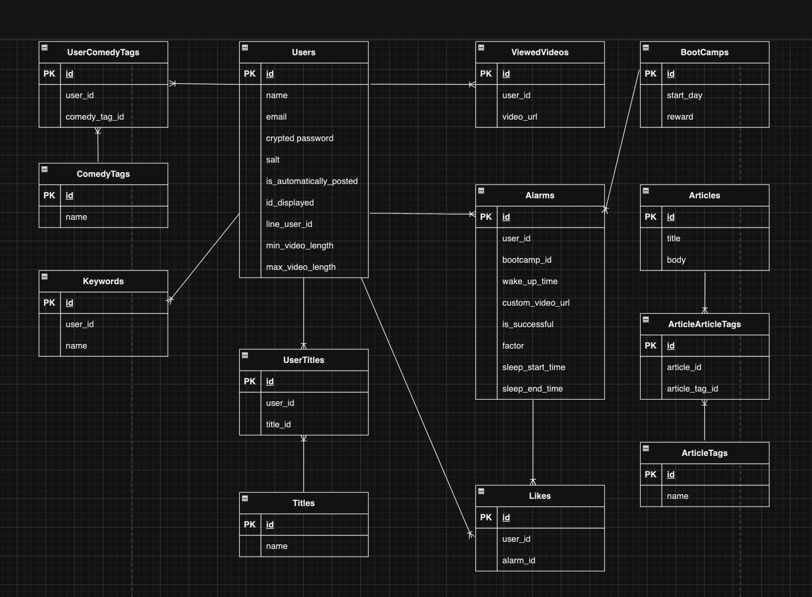

# [わらいず]

## サービス概要

わらいずは、予定通りの時間に起きられると報酬としてレコメンドされたお笑い動画を観ることができる、早起き促進アプリです。
タイトルは、笑いと「太陽が昇る、起床する」という意味の rise をかけています。

##　想定されるユーザー層
昼夜逆転してしまっており、早起きの習慣をつけたい人
早起きが億劫で、楽しく朝を迎えたい人

## サービスコンセプト

フルコミットでプログラミング学習をしている期間、昼夜逆転してしまうのがずっと課題でした。
昼夜逆転していると、
睡眠の質が下がり、睡眠時間が長くなる
スクールの講師の方や他の生徒の方と生活リズムが合わず、コミュニケーションが難しくなる
日中の用事ができなくなる
といったデメリットが存在し、一方メリットは特にないと感じたからです。
そして、他の生徒の方も同様の課題を感じていたので、これを解決したいと考え、本アプリを企画しました。

早起きをした方が良いのにできない大きな理由は、報酬を感じづらいからだと考えます。
例えば、目の前の美味しそうなご飯を食べたいと思うのは、美味しいという快感情の報酬を即時的に獲得できるからです。
これによりドーパミンが分泌され、該当の行動が強化されます。だから次も同じものを食べたくなるのです。
一方、早起きの報酬は即時的なものではないし、早起きによって得られる感情は、不快感情であることが多いと感じます。
結果、早起きという行動を強化できません。だから早起きを習慣化するのは難しいのです。学習の習慣化が難しいのも同様の理由だと考えます。
ならば、快感情を獲得できる即時的な報酬を別で用意すれば良いのではないかと考えました。それが youtube にアップされているお笑い動画です。
実際、予定した時間に起きられたら好きなお笑い動画を観られるというルールを自分に課した結果、昼夜逆転を改善することができました。
しかし、
お笑い動画を毎回探すのが面倒
私は元々好きなお笑い芸人がいたのでそれを見ることで快感情を容易に獲得できただけであり、他の方もそうとは限らない
という新たな課題も生まれました。
しかしこれは、ユーザーの嗜好性やニーズに合った youtube のお笑い動画をレコメンドすることで解決できると感じました。
また、そのほかにも早起きの習慣化をサポートする機能を搭載することで、早起きという行動を強化し習慣化できる枠組みを形成したいと考えます。
競合は、現在 RUNTEQ 内でよく用いられている「おはログ！」だと考えます。
私のアプリの差別化ポイントはやはり、お笑いという要素で行動の動機付けをより強く行なっている点であると考えます。

## 実装を予定している機能

### MVP

- 会員登録
- ログイン
- LINE ログイン
- お笑いの嗜好性（お笑いに関するタグ、キーワード、動画の長さ）設定機能
- 翌日に起床する時間を設定する機能（報酬としてレコメンドされた動画を見ることもできるし、自身でカスタムすることもできる）
- 翌朝、起床報告をし、レコメンドされた動画を視聴できる機能（設定した時間になってから 10 分は解除可能）
  ・具体的な手順
  起床 → マイページへ → 設定時間から 10 分の間、「起床」ボタンが出現するので、それを押す → 動画試聴ページにレコメンドされ、それを視聴 → 起床成功となる
- 動画が気に入らなかったら、他の動画をレコメンドしてくれる機能
  ・詳細
  もう一度同じ情報でレコメンド動画を取得します。ただし、一度レコメンドしてもらった動画を保存するテーブルを作成し、一度レコメンドされた動画は表示されないようにします。
- 起床成功後に試聴した動画と試聴成功をポスト（ツイート）できる機能
- 失敗した時にモチベを上げる文言を表示する機能
- 起床時間と起床成功 or 失敗を記録し表で振り返ることができる機能
- 月ごとの起床成功回数のランキング（起床時間は自分で設定したもので良い）機能(ランキング参加は任意)
- 起床時間になったことを LINE で通知する機能
- 他のユーザーの起床成功情報を一覧で見れる機能（表示は任意）

### その後の機能

- 起床成功後に、すぐ次の日の起床時間を設定することを促進する機能（これによって 1 日のタイムマネジメント意識がつく）
- 毎週末、その週の起床時間、起床成功 or 失敗を LINE でリマインドする機能
- 成功時に「なぜ成功したか」、失敗時に「なぜ失敗したか」を記録でき、振り返れる機能
- 習慣化の理論や、よくある早起き失敗例（睡眠の質が低かった等）とその解決策をまとめたコラム
- ブートキャンプ機能（1 週間の起床時間最初に全てを決めてしまい、達成率を確認できる。1 週間達成した際の報酬も最初に決める（これは大きな報酬が良いと思うので、動画じゃなくて良い））
- 称号機能（起床成功回数で称号を獲得できるもの。獲得したらポストして共有できるようにする）
- 成功 or 失敗時に睡眠時間も記録し、その時間を振り返ることができる機能
- レスポンシブデザイン対応（基本的に PC での使用を想定しているので、後からスマホにも対応させる）
- 起床成功 or 失敗時にそれを強制的にポストするように設定できる機能
- パスワードリセット機能
- Hotwire 導入

## Figma のリンク

https://www.figma.com/file/ZReC0nwGyNlWT20LhTTk2Q/graduation_exam-%E3%82%8F%E3%82%89%E3%81%84%E3%81%9A?type=design&node-id=0%3A1&mode=design&t=vJTmHqRe6zAULy6k-1

## ER 図

## 使用技術

- ■ サーバサイド: Ruby on Rails
  　　 Ruby 3.1.0 Rails 7.0.8
- ■ CSS フレームワーク: tailwindCSS、daisyUI
- ■ WebAPI: LINE ログイン、Line messaging API、Youtube Data API
- ■ インフラ:
- ・ Web アプリケーションサーバ: heroku
- ・ データベースサーバ: PostgreSQL（Fly Postgres）
- ■ その他：
- ・ VCS: GitHub
- ・ CI/CD: GitHubActions

# WaRise. / 「お笑い」と「アラーム」を掛け合わせた、早起き促進サービス

## サービス概要

WaRise（わらいず）は、設定時間に起床すると、ご褒美としてお笑い動画をレコメンドしてくれる、早起き促進アラームアプリです。

プログラミング学習中、昼夜逆転の生活になってしまうことが課題で、スクール内の多くの受講生も同様の問題を抱えていました。
早起きの習慣化が難しい原因は、早起きはやった方が良いが辛いものである点だと考えたため、報酬によってそれを楽しいものにできるように本アプリを作成しました。

### ▼ サービス URL

https://www.wa-rise.com

レスポンシブ対応済のため、PC でもスマートフォンでも快適にご利用いただけます。

### ▼ 開発者 Twitter

https://twitter.com/YA3lrpq2PnRc3ge

何かございましたら、こちらまでお気軽にご連絡ください。

## メイン機能

<table>
  <tr>
    <th style="text-align: center">アラーム機能</th>
    <th style="text-align: center">みんなの起床情報</th>
  </tr>
  <tr>
    <td>
      
      アラームの時刻になったらLINEで通知をします。 
      10分以内に、あなたの嗜好に合わせてレコメンドされたお笑い動画を視聴しましょう（表示される動画を選ぶこともできます）。 
      以前のアラーム情報は記録され、カレンダーでいつでも振り返ることができます。
    </td>
    <td>
      
      他のユーザーの起床情報を一覧で確認することができます（自信を非表示にすることも可能）。 
      仲間の頑張りを見てモチベーションを上げましょう！
    </td>
  </tr>
</table>

## 機能一覧

- LINE ログイン
- お笑いの嗜好性（お笑いに関するタグ、キーワード、動画の長さ）設定機能
- アラーム機能
  起床後に、設定したアラーム時刻から 10 分間の間、嗜好性に基づいてレコメンドされたお笑い動画を視聴できる。
  動画の URL を添付することで、自身で選択することもできる。
  もし動画が気に入らなかったら、別の動画をレコメンドしてもらうことができる。
  同じ動画は二度表示されない（視聴しなかったものも含めて）。
- アラームの時刻に、LINE 公式アカウントからプッシュ通知を受け取ることができる機能
- 起床成功後に試聴した動画と試聴成功をポスト（ツイート）できる機能
- 自信が設定したアラームの情報をカレンダーで振り返ることができる機能
- 他のユーザーの起床成功情報を一覧で見れる機能（自身の表示は任意）

## 今後実装予定の機能

- LINE 上でアラーム登録やレコメンド動画視聴を完結できる機能
- 一週間の振り返りを LINE 通知する機能
- 本アプリの効果を実感できるような、お笑いや睡眠に関するコラムを定期的に送信する機能

## 使用技術一覧

**バックエンド:** Ruby 3.1.0 / Rails 7.0.8

- コード解析 / フォーマッター: Rubocop

**フロントエンド:** JavaScript / Hotwire

**CSS フレームワーク:** TailwindCSS / DaisyUI

**WebAPI:** LINE ログイン / LINE Messaging API / Youtube data API / Cloudinary

**インフラ:**

- Web アプリケーションサーバ: Render.com
- データベースサーバ: PostgreSQL (Render.com)
- バックグラウンドワーカー: Sidekiq (Render.com)
- キューストレージ: Redis (Render.com)

**VCS:** GitHub

## ER 図

## 画面遷移図のリンク

https://www.figma.com/file/ZReC0nwGyNlWT20LhTTk2Q/graduation_exam-%E3%82%8F%E3%82%89%E3%81%84%E3%81%9A?type=design&node-id=0%3A1&mode=design&t=vJTmHqRe6zAULy6k-1
